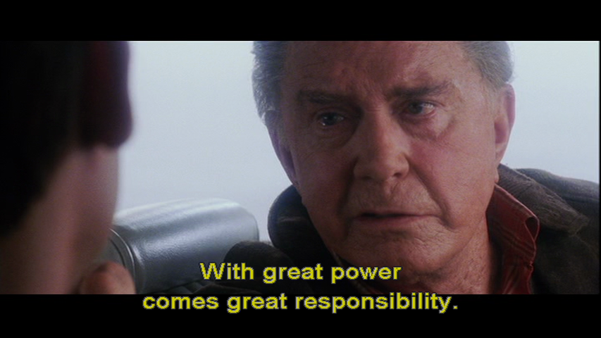

<!--

WARNING!! DON'T EDIT THE FILE README.md on the root of the project, that one is a GENERATED FILE!

You should just edit the source file at src/README.md - the one which stars with ## Design patterns for JavaScript

-->

## Design patterns for JavaScript

Based on the work of [Stoyan Stefanov](https://twitter.com/stoyanstefanov) and [Addy Osmani](https://twitter.com/addyosmani)

<br/><br/><br/><br/>

[Tiago Garcia](https://twitter.com/tiagooo_romero) @ [Mobile+Web DevCon](http://mobilewebdevconference.com/)

*http://tiagorg.com*

Feb 5th, 2015

---

## Tiago Garcia


- Tech Manager at [Avenue Code](http://www.avenuecode.com) 
- Tech Lead at [Macys.com](http://www.macys.com).
- Organizer of the [Backbone.js Hackers meetup in SF](http://www.meetup.com/Backbone-js-Hackers).


---

## Agenda

- Patterns and Design Patterns
- JavaScript Design Patterns
    - Constructor
    - Module
    - Fa&ccedil;ade
    - Observer aka Custom Event
    - Mediator aka Pub-Sub
- Large-Scale JavaScript
    - Proposed architecture
    - Applying patterns  

---

## Prerequisites

- Intermediate JavaScript
- Advanced OOP
- Familiarity with Design Patterns
- Curiosity

---

## Patterns

- Pattern: 
    - Proven *solution* to a certain class of *problems* in a specific *context*.
    - Pre-conditions (requirements).
    - Post-conditions (consequences). 
- Pattern *language*: a common vocabulary.
    - *Network* of connected patterns -> reuse.

----

## Design Patterns

- Design Patterns address common OOP problems.
- 1994: *Gang Of Four* publishes [Design Patterns](http://www.amazon.com/Design-Patterns-Object-Oriented-Professional-Computing/dp/0201634988), a truly watershed in the history of OOP and the debut of the term.
   - Features 23 classic design patterns, categorized in *creational*, *structural* and *behavioral*.
   - Many people believe that "Design Patterns" term is exclusive to those 23 patterns, which is not the case.
- Back in 1994, programming languages and frameworks native support to Design Patterns was rough.
- Nowadays, many of those patterns have been incorporated into programming languages and frameworks.

----

## Remember Uncle Ben!



---

## JS Design Patterns

- JS code is more complex today than ever before, as we are bringing the desktop experience to the web, abusing of events, ASYNC, SPA, unit testing, etc.
- Good reasons to use Design Patterns in JS:
   - Avoid "spaghetti code" (hard to read and maintain for the lack of structure).
   - Improve overall maintainability, making it clear to identify where to change the code.
   - Enable more objective unit tests.
- Today we are covering some Design Patterns for Large-scale JS applications.

---

## Constructor

- A special method used to initialize a newly created object once memory has been allocated.
- JS is indeed OO but it differs from classic OO, and there are different ways to construct an object:
```javascript
  // object literal a.k.a. Singleton
  var myDog = {};
 
  // ES5 Object.create method from prototype
  var myDog = Object.create(Dog.prototype);
 
  // constructor call (uses this to set properties)
  var myDog = new Dog();
```

----

## Basic Constructor

- *new* must be used before invoking.
- *this* references the new object being created.
- Doesn't return anything.
```javascript
  function Dog(name, breed) {
    this.name = name;
    this.breed = breed; 
    this.bark = function() {
      return this.name + ': woof, woof, woof!';
    };
  }
 
  var myDog = new Dog('Sherlock', 'beagle');
  console.log(myDog.bark());
```

----

## Prototype

- Defining functions in the constructor is not ideal, as the function will be redefined for each new instance.
- Using the *prototype*, all instances can share functions.
```javascript
  function Dog(name, breed) {
    this.name = name;
    this.breed = breed;
  }
    
  Dog.prototype.bark = function() {
      return this.name + ': woof, woof!';
    };
  }
   
  var myDog = new Dog('Sherlock', 'beagle');
  console.log(myDog.bark());
```

---

## Module

- Emulates classic OO classes to support public/private methods and variables inside a single object.
- Encapsulation achieved through closures.
```javascript
  var myDog = (function(name, breed) {
    var getBarkStyle = function() {
      return (breed === 'husky')? 'woooooow!': 'woof, woof!';
    }; 

    return {
      bark: function() {
        return name + ': ' + getBarkStyle();
      }
    };
  })('Sherlock', 'beagle');

  console.log(myDog.bark());
```

----

## Revealing Module

- Adds flexibility to switch methods and variables from public to private scope and vice-versa.
```javascript
  var myDog = (function(name, breed) { 
    function getBarkStyle() {
      return (breed === 'husky')? 'woooooow!': 'woof, woof!';
    }; 
    function bark() {
      return name + ': ' + getBarkStyle();
    };  

    return {
      name: name,
      bark: bark
    };
  })('Sherlock', 'beagle');

  console.log(myDog.bark());
```

----

## Module

- Highly enforced by JS community.
- First-class citizen in *CommonJS* and *AMD*.
```javascript
  // CommonJS syntax
  exports.sum = function(numberA, numberB) {
    return numberA + numberB;
  };
```
```javascript
  // AMD syntax
  define([], function() {
    return {
      sum: function(numberA, numberB) {
        return numberA + numberB;
      }
    };
  });
```
- Will be part of ES 6 Harmony - the upcoming version of JS.

---

## Fa&ccedil;ade

- Provides a convenient higher-level interface to a component, hiding its complexity and simplifying the API.
```javascript
  // Pure JS
  var xhr = new XMLHttpRequest();
  xhr.open('GET', 'http://code.jquery.com/jquery-latest.js', true);
  xhr.onreadystatechange = function() {
    if (this.readyState == 4 && this.status === 200) {
      console.log('success');
    }
  };

  // jQuery
  $.get('http://code.jquery.com/jquery-latest.js', function(data) {
     console.log('success');
  });
```

----

## Fa&ccedil;ade

```javascript
var factorialFacade = (function() { 
  var intermediateResults = [0, 1];
  function calculate(n, stats) {
    if (intermediateResults[n] === undefined) {
      stats.ops++;
      intermediateResults[n] = n * calculate(n - 1, stats);
    }
    return intermediateResults[n];              
  }
  return {
    factorial: function(n) {
      var stats = { ops: 0 },
          result = (n > 0 && n % 1 === 0)? calculate(n, stats): 0;
      return n + '! = ' + result + ' (' + stats.ops + ' operations)';
    }
  };
})();
```

[See this live on Plunker!](http://plnkr.co/edit/RxgtEUzah6DmC1jnlcim?p=preview)

---

## Observer/Custom Event

- A Subject object maintains a list of interested Observer objects, automatically notifying them of its changes.
```javascript
  // Observers aka Listeners
  var consoleObserver = function(event, msg) {
    if (event === 'goal') {
      console.log(msg.team + ' team just scored! ' + msg.score);
    }
  }
    
  var htmlObserver = function(event, msg) {
    if (event === 'goal') {
      $('h3').text(msg.team + ' team just scored! ' + msg.score);
    }
  }
```

----

## Observer/Custom Event

```javascript
  // Subject aka Event Emitter
  var soccerMatchSubject = (function(teamA, teamB) {
    var scoreTable = {},
        observers = [];

    scoreTable[teamA] = scoreTable[teamB] = 0;   

    function notify() {
      var args = arguments;
      $.each(observers, function(index, observer) {
        observer.callback.apply(observer.context, args);
      });
    }

    //... continues on the next slide
```

----

## Observer/Custom Event

```javascript
  //... from the previous slide
  return {

    addObserver: function(fn) {
      observers.push({ context: this, callback: fn });
    },

    // notifier method
    goal: function(team) {      
      scoreTable[team]++;
      score = teamA + ' ' + scoreTable[teamA] + ' x ' + 
              scoreTable[teamB] + ' ' + teamB;
            
      notify('goal', { team: team, score: score });
    }
  };

})('Brazil', 'Germany');
```

----

## Observer/Custom Event

- Now we just need to add the observers to listen.
```javascript
  soccerMatchSubject.addObserver(consoleObserver);
  soccerMatchSubject.addObserver(htmlObserver);
```
- Notifier method is called -> all its observers will execute.
- *Reduced coupling:* the observers and subject do not have hard dependencies on each other.
- [See this live on Plunker!](http://plnkr.co/edit/zOYp5LUINc3GzylhxrZH?p=preview)

---

## Mediator/Pub-Sub

- Exposes an unified interface through which the different parts of a system may communicate.
- Using *Observer* reduces the coupling, but notice how the Subject still hold references to the Observers.
- Potential Garbage Collection issues: you must remember to remove the Observer references from all the Subjects.
- A *Mediator* can completely decouple Subject and Observers by introducing a intermediate layer in between.

----

## Mediator/Pub-Sub

```javascript
  var mediator = {
    channels: {},
    subscribe: function(channel, fn) {
      if (!mediator.channels[channel]) mediator.channels[channel] = [];
      mediator.channels[channel].push({ context: this, callback: fn });
    },
    publish: function(channel){
      if (!mediator.channels[channel]) return;
      var args = Array.prototype.slice.call(arguments, 1);
      $.each(mediator.channels[channel], function(index, subscriber) {
        subscriber.callback.apply(subscriber.context, args);
      });
    },      
    installTo: function(publisher){
      publisher.subscribe = mediator.subscribe;
      publisher.publish = mediator.publish;
    }
  };
```

----

## Mediator/Pub-Sub

```javascript
  var soccerMatchSubject = (function(teamA, teamB) {
    var scoreTable = {};
    scoreTable[teamA] = scoreTable[teamB] = 0;
    
    return {
      goal: function(team) {      
        scoreTable[team]++;
        score = teamA + ' ' + scoreTable[teamA] + ' x ' + 
                scoreTable[teamB] + ' ' + teamB;
                  
        this.publish('loggers', 'goal', { team: team, score: score });
      }
    };
  })('Brazil', 'Germany');
    
  mediator.installTo(soccerMatchSubject);
```

---

## Large-scale Javascript

- Large-scale is not about LOC or app size.
- Large-scale is about the architectural support for growing in size while not growing in complexity.
- To make this possible we need:
    - cohesive modules
    - low coupling between modules
    - module independency
    - module replaceability
    - module security
    - some infrastructure to control the modules

---

## Proposed Architecture

- Employing patterns Module, Fa&ccedil;ade and Mediator:
    - *Module* to encapsulate components / features.
    - *Fa&ccedil;ade* to create a secure sandbox around the Modules.
    - *Mediator* to orchestrate the Modules in terms of:
        - publish and subscribe
        - lifecycle (add, remove, start, stop)
        - delivering messages
- A Module can publisher, subscriber or both.

---

## Applying patterns

```javascript
  var NewEmailModule = function(from) {
    return {
      newEmail: function(email) {
        email.from = from;
        this.publish('email', { email : email });
      }
    };
  };
    
  var myNewEmail = NewEmailModule('tgarcia@avenuecode.com');
  mediator.installTo(myNewEmail);
```

----

## Applying patterns

```javascript
  var MailboxModule = function(owner, channel) {
    var emails = [];
      
    return {
      receiveEmail: function(message) {
        if (message.email.to === owner) {
          emails.push(message.email);
          this.publish(channel, { owner: owner, emails: emails });
        }
      }
    };
  };
    
  var myMailbox = MailboxModule('tgarcia@avenuecode.com', 'my-mailbox');
  mediator.installTo(myMailbox);
  mediator.subscribe('email', myMailbox.receiveEmail);
```

----

## Applying patterns

```javascript
  var RenderMailboxModule = function(selector) {
    var el = $(selector);
      
    return {
      render: function(message) {
        var frag = $(document.createDocumentFragment());
        $.each(message.emails, function(index, email) {
          frag.append('<h3>[' + index + '] ' + email.subject + '</h3>')
              .append('<h4>From: ' + email.from + '</h4>')
              .append('<p>' + email.content + '</p>');
        });
        el.html(frag);
      }
    };
  };

  var myRenderMailbox = RenderMailboxModule('#my-mailbox');
  mediator.subscribe('my-mailbox', myRenderMailbox.render);
```

----

## Applying patterns

- This is the event triggering:
```javascript
  $('button').click(function(e) {
      e.preventDefault();
      var email = {
        to: $('input[name=to]').val(),
        subject: $('input[name=subject]').val(),
        content: $('textarea[name=content]').val()
      };
      myNewEmail.newEmail(email);
    });
  });
```
- Notice how a module doesn't know about other modules.
- [See this live on Plunker!](http://plnkr.co/edit/UVB6IIawq5YySC1T5c3f?p=preview)

---

## Conclusion

- Design Patterns provide recommended solutions for common problems in OOP.
- Javascript badly needs that to avoid "spaghetti code".
- Patterns as Module, *Fa&ccedil;ade and Mediator can be combined in a solid solution for Large-Scale JS.
- It is very important to avoid coupling at all costs in order to leverage scalability and maintainability.

---

## Learn more

- [Javascript Patterns - Stoyan Stefanov](http://shop.oreilly.com/product/9780596806767.do)
- [Learning JavaScript Design Patterns - Addy Osmani](http://addyosmani.com/resources/essentialjsdesignpatterns)
- [Patterns for Large-Scale JavaScript Application Architecture - Addy Osmani](http://addyosmani.com/largescalejavascript)
- [AuraJS](http://aurajs.com)

---

## Challenge

*Write a large-scale client-side app using design patterns.*

- For Backbone.js devs:
    1. Fork my quiz app from https://github.com/tiagorg/quiz-app
    1. Read the instructions on [README.md](https://github.com/tiagorg/quiz-app#refactor-to-design-patterns-for-large-scale-js)
    1. Send me your GitHub repo with the solution.
- Alternatively, write your application from scratch.
